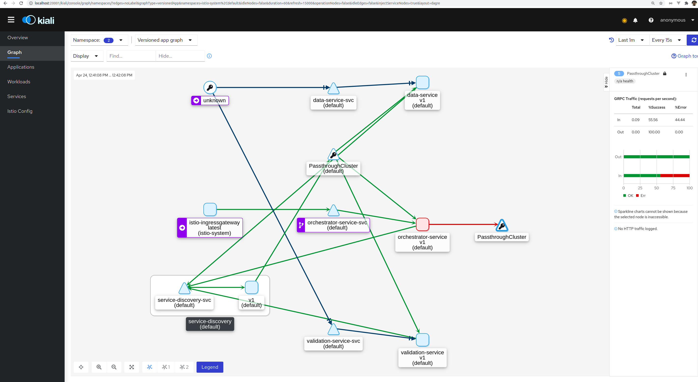
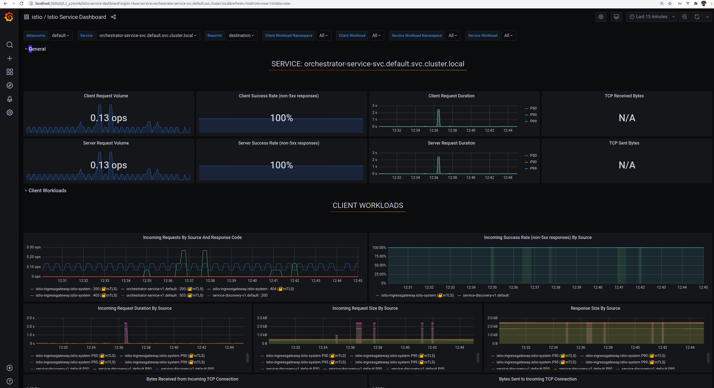
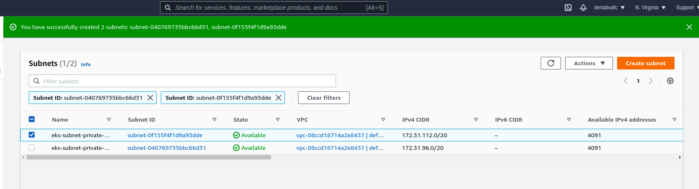
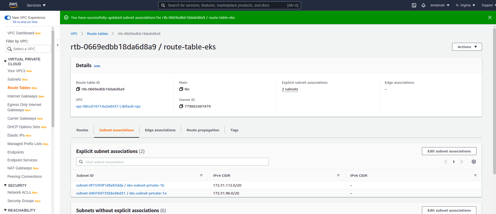
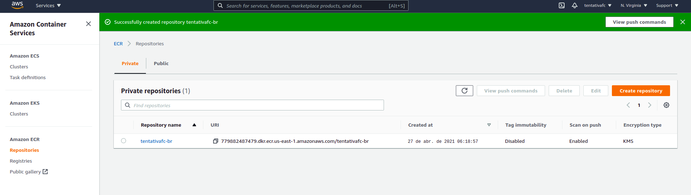
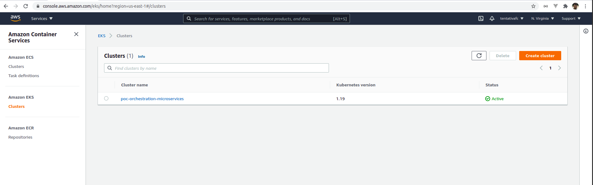

# POC Microservices Orchestration

POC for testing microservices orchestration patterns.

## Run:

Checkout this project and install into local repository (with this bug [#495](https://github.com/yidongnan/grpc-spring-boot-starter/issues/495) fixed):

```sh
git clone git@github.com:tentativafc/grpc-spring-boot-starter.git
cd grpc-spring-boot-starter
./gradlew publishToMavenLocal
```

Make projects and run docker compose (Build, Uploads images and start docker compose)

```sh
./make.sh
```

#### Docker Environment

Start application

```sh
docker-compose up -d
```

### Services and port numbers:

| Service                         | Port Number | Type/Tech       |
| ------------------------------- | ----------- | --------------- |
| Mysql Data-Service              | 3306        | DB              |
| Mysql Validation-Fields-Service | 3307        | DB              |
| DLQ                             | 5672        | Rabbit MQ       |
| Data-Service                    | 8080        | Spring Boot App |
| Validation-Fields-Service       | 8081        | Spring Boot App |
| Data-Service-RPC                | 9090        | GRPC            |
| Validation-Fields-Service-RPC   | 9091        | GRPC            |
| Orchestrator-Service            | 8082        | Spring Boot App |
| Service-Discovery               | 8500        | Consul          |
| Frontend                        | 8083        | VUEjs           |

---

Generate data for performance tests (Jmeter script Test Plan.jmx)

1. Create virtualenv and install python dependencies

2. Make projects and run docker compose (Build, Uploads images and start docker compose) this step does not need repeat.

   ```sh
   cd backend/gen-data
   virtualenv env
   source env/bin/activate
   pip install -r requirements.txt
   ```

3. Generate data:

   ```sh
   ./gen_data.sh
   ```

### K8S Environment

Create cluster

```sh
k3d cluster create k3d-poc-orchestration-cluster --servers 1 --agents 3 --port 9080:80@loadbalancer --port 9443:443@loadbalancer --api-port 6443 --k3s-server-arg '--no-deploy=traefik'
k3d kubeconfig merge k3d-poc-orchestration-cluster --kubeconfig-switch-context
kubectl cluster-info
kubectl get pods --all-namespaces

# Delete if you need
k3d cluster delete k3d-poc-orchestration-cluster
```

#### Config Istio

Download [Istio](https://istio.io/latest/docs/setup/getting-started/#download)

Install istio [profile](https://istio.io/latest/docs/setup/additional-setup/config-profiles/)

```sh
istioctl install --set profile=demo -y
```

Add a namespace label to instruct Istio to automatically inject Envoy sidecar proxies when you deploy your application later

```sh
kubectl label namespace default istio-injection=enabled
```

Install addons (Prometheus, Grafana, Jaeger and Kiali):

```sh
kubectl apply -f samples/addons
```

#### Deploy applications

Simple application

```sh
kubectl apply -f k8s/demo.yaml
# Testing
kubectl exec "$(kubectl get pod -l app=demo -o jsonpath='{.items[0].metadata.name}')" -c demo -- curl -sS http://demo-svc:8080/demo

```

Install Service Discovery and Databases

```sh
kubectl apply -f k8s/infra.yaml
```

Install Data Service

```sh
kubectl apply -f k8s/data-service.yaml
# Testing
kubectl exec "$(kubectl get pod -l app=data-service -o jsonpath='{.items[0].metadata.name}')" -c data-service -- curl -sS http://data-service-svc:8080/actuator/health
```

Install Validation-Service

```sh
kubectl apply -f k8s/validation-service.yaml
# Testing
kubectl exec "$(kubectl get pod -l app=validation-service -o jsonpath='{.items[0].metadata.name}')" -c validation-service -- curl -sS http://validation-service-svc:8080/actuator/health
```

```sh
kubectl apply -f k8s/orchestrator-service.yaml
# Testing
kubectl exec "$(kubectl get pod -l app=orchestrator-service -o jsonpath='{.items[0].metadata.name}')" -c orchestrator-service -- curl -sS http://orchestrator-service-svc:8080/actuator/health
```

Check services and pods

```sh
# Check services
kubectl get services
# Check if service is binding to pod
kubectl describe svc <service_name>
#Check pods
kubectl get pods
#Check pods logs
kubectl logs <pod_name>
# If you need inspect process/files on pod (replaces <app_name>)
kubectl exec -it exec "$(kubectl get pod -l app=<app_name> -o jsonpath='{.items[0].metadata.name}')" -- sh
```

#### Enable Ingress Connection

Gateway config

```sh
kubectl apply -f k8s/orchestrator-gateway.yaml
```

Get ingress server and port

```sh
kubectl get svc istio-ingressgateway -n istio-system

export INGRESS_HOST=$(kubectl -n istio-system get service istio-ingressgateway -o jsonpath='{.status.loadBalancer.ingress[0].ip}')
export INGRESS_PORT=$(kubectl -n istio-system get service istio-ingressgateway -o jsonpath='{.spec.ports[?(@.name=="http2")].nodePort}')
export SECURE_INGRESS_PORT=$(kubectl -n istio-system get service istio-ingressgateway -o jsonpath='{.spec.ports[?(@.name=="https")].nodePort}')
export GATEWAY_URL=$INGRESS_HOST:$INGRESS_PORT
echo "$GATEWAY_URL"
```

Open in browser this url:

```sh
echo "http://$GATEWAY_URL/actuator/health"
```

### Dashboards

Kiali

```sh
istioctl dashboard kiali
```



Grafana

```sh
istioctl dashboard grafana
```



### AWS

Create the subnets



Create and associate route tables to subnets



Create the ECR



Push images to ECR

```sh
# Docker login
aws ecr get-login-password --region us-east-1 | docker login --username AWS --password-stdin 779882487479.dkr.ecr.us-east-1.amazonaws.com
# Build image and push
cd backend/demo
mvn clean compile package
docker build -t demo:latest -f Dockerfile .
docker tag tentativafc-br:latest 779882487479.dkr.ecr.us-east-1.amazonaws.com/tentativafc-br:demo
docker push 779882487479.dkr.ecr.us-east-1.amazonaws.com/tentativafc-br:demo
```

Create cluster EKS (eksctl)

```sh
# Creates using eksctl
eksctl create cluster --name poc-orchestration-microservices --version 1.19 --region us-east-1 --nodegroup-name ng-poc-1 --node-type m5.xlarge --nodes 2 --nodes-min 1 --nodes-max 3 --managed
# Delete if you need
eksctl delete cluster --name poc-orchestration-microservices
```

Or Cloudformation

```sh
# Create cluster
aws cloudformation create-stack --stack-name poc-eks-cluster --template-body file://AWS/eks-cluster-cf-template.json --capabilities CAPABILITY_IAM
# Create nodegroup
aws cloudformation create-stack --stack-name poc-eks-cluster-nodegroup --template-body file://AWS/eks-nodegroups-cf-template.json --capabilities CAPABILITY_IAM
```

Or Terraform

```sh
cd AWS
# Init terraform state
terraform init
# Create infra
terraform apply
```



Enable kubectl connection

```sh
aws eks update-kubeconfig --name poc-orchestration-microservices --region us-east-1
```

#### Commands:

Force container recreation:

```sh
docker-compose up --build --force-recreate  data-service
```

Stop all containers:

```sh
docker-compose down
docker stop $(docker container  ls -aq)
```

Run Spring Boot like nodemon (nodejs)

```sh
./mvnw spring-boot:run
```

Delete all containers:

```sh
docker rm -f $(docker container  ls -aq)
```

Create docker image and push to docker-hub:

```sh
docker build -t tentativafc/ib-sts-service:1.0-snapshot -f Dockerfile .
```

```sh
docker push tentativafc/ib-sts-service:1.0-snapshot
```

Run docker image:

```sh
docker run --rm -d --network host --name my_sts_service sts-service:latest
```

Generating GRPC stub:

```sh
protoc sts.proto --go_out=plugins=grpc:.
```

Configure pod or service:

```sh
kubectl apply -f <filename>
```

Delete running pod or service:

```sh
kubectl delete -f <filename>
```

List pods, services or deployments:

```sh
kubectl get <pods/services/deployments>
```

Detail object:

```sh
kubectl describe <object type> <object name>
```

Create and list secrets:

```sh
kubectl create secret <type of secret> <secret name> --from literal key=value
kubectl get secrets
```
